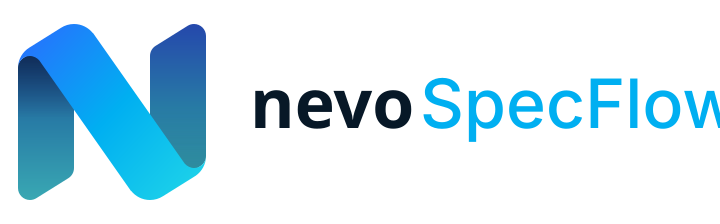

<p align="center">
  <picture>
    <source media="(prefers-color-scheme: dark)" srcset="./assets/brand/nevo-specflow-repository-dark.svg">
    <source media="(prefers-color-scheme: light)" srcset="./assets/brand/nevo-specflow-repository-light.svg">
    
  </picture>
</p>

**Nevo SpecFlow** is a spec-driven development framework for AI-assisted software
engineering: a human-led, spec-anchored workflow designed around a CLI (`nevo-specflow`), a local Runtime, and an interactive UI.

The repository currently contains the public CLI, a real local Runtime server, and the authentication foundation. The deterministic SpecFlow workflow and product UI are still being migrated. The exact implemented CLI surface is documented in [`docs/reference/cli/nevo-specflow-contract.md`](docs/reference/cli/nevo-specflow-contract.md).

- **Human-led.** The repository owner makes the architectural and scope calls; AI agents
  propose options and implement approved work inside an explicitly declared context.
- **Spec-anchored.** Non-trivial changes are tied to a specification, classified by
  weight, with explicit owner approval gates.
- **Deterministic and tool-enforced.** The spec/task lifecycle and documentation
  discovery run through commands with stable, machine-readable output.
- **Vendor-neutral.** The workflow is exposed to AI coding agents through thin adapters
  over a single source of truth.

See [`docs/product/specflow/overview.md`](docs/product/specflow/overview.md) for the
product overview and [`docs/`](docs/README.md) for everything else.

## Getting started

```bash
corepack enable                 # once per machine
pnpm install                    # Node 24 LTS (.nvmrc), pnpm 10 via Corepack
pnpm check                      # the full local quality gate
```

`pnpm check` runs format, lint, documentation validation, the version-metadata gate,
and every package's typecheck / test / build. Full setup and the command reference:
[`docs/engineering/repository/local-setup.md`](docs/engineering/repository/local-setup.md).

## Repository shape

| Path        | Contents                                                                                                                                                                                             |
| ----------- | ---------------------------------------------------------------------------------------------------------------------------------------------------------------------------------------------------- |
| `apps/`     | Deployable applications. Workspace glob; populated when an app lands.                                                                                                                                |
| `packages/` | Product packages under the `@nevo/*` scope; individual packages may be public or internal/private. Workspace glob; populated when a package lands.                                                   |
| `tools/`    | Repository-internal tooling such as [`docs`](tools/docs/README.md), [`release`](tools/release/README.md), and [`github`](tools/github/README.md). Product packaging is owned by `packages/specflow`. |
| `docs/`     | [Documentation](docs/README.md): architecture, engineering, design system, product, reference, and instructions.                                                                                     |

## Contributing

Branches and pull requests only — no direct commits to `main` or `release/v*`. Squash
merge; the PR title is the commit message and follows Conventional Commits. See
[`CONTRIBUTING.md`](CONTRIBUTING.md) and
[`docs/engineering/repository/git-workflow.md`](docs/engineering/repository/git-workflow.md).

## License

[MIT](LICENSE) — see ADR
[`0004-mit-license`](docs/architecture/decisions/0004-mit-license.md).
